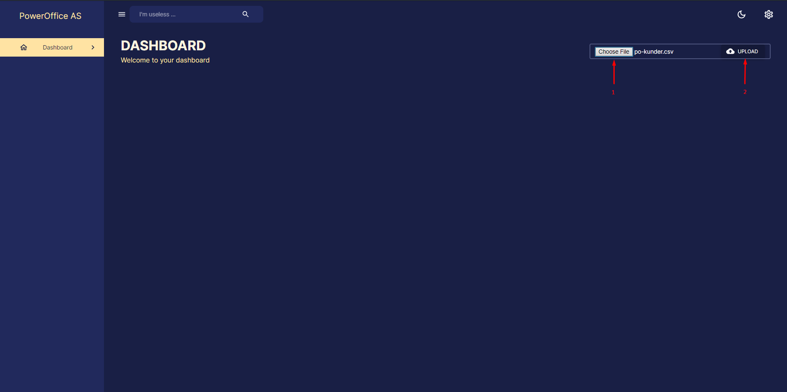
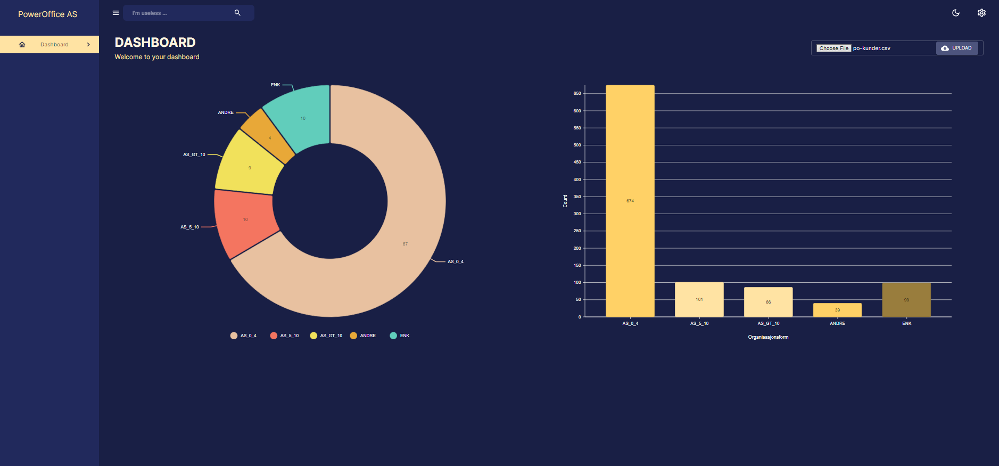

In this project our aim is to receive a .csv file and then utilize the open API of
Brønnøysundregisteret and create a new .csv file with the following parameters.

- OrgNo
- Name
- AntallAnsatte
- Naeringskode
- Organisasjonsform
- BrregNavn

Once the file has been generated, the next step will be to use the data within the file to create and present various statistics.

To accomplish this I create a C# .Net 6 ASP.NET Core API and a Frontend using React.

### Software Patterns

- **Dependency Injection**: In the Controller, for example, there are two services being injected.

- **Repository Pattern**: The `BrregClient` class acts as a repository for retrieving information about organizations from an external data source. The `GetOrganization` method retrieves organization information from an external API, transforms the data, and returns it to the caller. Possibly could have been under a Repository Folder, but since it is contacting an external API decided to keep it as a Service.

- **Factory Pattern**: The `SemaphoreSlim` is used in the `BrregClient` class to limit the number of concurrent requests to the external API. The `Lazy<SemaphoreSlim>` creates an instance of `SemaphoreSlim` on demand and caches it for future use.

- **Strategy Pattern**: The `IMapper` interface is used to abstract away the details of mapping between different object types. Different implementations of `IMapper` can be used depending on the mapping requirements.

- **Interface Pattern**: By using an interface, any class that implements the `IOrganizationService` interface can be used interchangeably with the `OrganizationService` class. This allows for easy swapping of classes that provide similar functionality, without needing to modify the code that uses them.

### Requirements

In response to the requirement "The program should mark bankrupt or deleted organizations," I introduced a new enumeration called `StatusEnum`. This enumeration has three possible values: `Bankrupted`, `Deleted`, or `Active`.

To determine if an organization is `Bankrupted`, we examine the `Konkurs` flag. To determine if an organization is `Deleted`, we had at least two options: to check whether `Naeringskode1` was not present in the response or to check the `slettedato`. Since we are storing `Naeringskode1`, I chose to go with the first approach.

One alternative approach would have been to implement the Hierarchy design pattern, where we create an abstract class with the common parameters and then create a separate concrete class for each `Status`. However, since all the `Status` classes have similar attributes and behaviors, I decided to stick with using the `StatusEnum`. It's worth considering that in the future, if the requirements change and become more complex, implementing the Hierarchy design pattern may be a good option.

To meet the requirement of limiting program parallelism to a maximum of two concurrent requests to the API, I implemented a solution that utilizes `SemaphoreSlim`. This solution creates a `SemaphoreSlim` object on demand and caches it for future use.

In this case, the priority would be the order in which the requests should be processed. The BrregClient could maintain a PriorityQueue of requests with each request having a priority level. The priority level could be determined based on the time the request was received, with earlier requests having a higher priority.

When a request comes in, it would be added to the PriorityQueue based on its priority level. The BrregClient could then process requests from the PriorityQueue in the order of their priority level, with a maximum of two requests being processed at any given time.

Using a PriorityQueue could have some advantages over the SemaphoreSlim approach. For example, it would allow for more fine-grained control over the order in which requests are processed. Additionally, if there are a large number of requests with varying priority levels, a PriorityQueue could be more efficient in terms of processing the requests in the most optimal order.

However, it's worth noting that implementing a PriorityQueue can be more complex than using a SemaphoreSlim, and may not necessarily be required for a simple use case like the one in the BrregClient class.

Implemented some tests using Moq Library to replicate some behaviours and trying to isolate each function for testing purposes.

### Azure

This application is also running on Azure https://powerofficeasui.azurewebsites.net

### Flow

